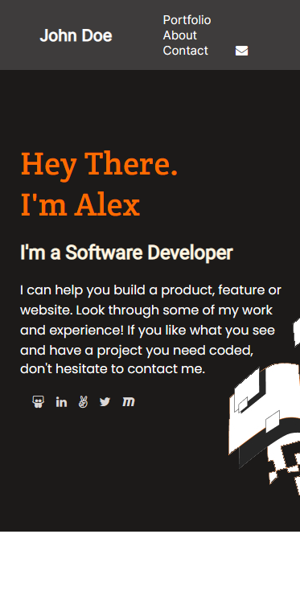

  
   

<!-- TABLE OF CONTENTS -->

# 📗 Table of Contents

- [📖 About the Project](#about-project)
  - [🛠 Built With](#built-with)
    - [Tech Stack](#tech-stack)
    - [Key Features](#key-features)
  - [🚀 Live Demo](#live-demo)
- [💻 Getting Started](#getting-started)
  - [Setup](#setup)
  - [Prerequisites](#prerequisites)
  - [Install](#install)
  - [Usage](#usage)
  - [Run tests](#run-tests)
  - [Deployment](#triangular_flag_on_post-deployment)
- [👥 Authors](#authors)
- [🔭 Future Features](#future-features)
- [🤝 Contributing](#contributing)
- [⭐️ Show your support](#support)
- [🙏 Acknowledgements](#acknowledgements)
- [📝 License](#license)

<!-- PROJECT DESCRIPTION -->

# 📖 Mobile First Portfolio 

The **portfolio** is made with mobile first priority as in today's world the usage of mobiles are increasing rapidly and most of the users are comfortable in finding info using their phone. That's why this portfolio is created with the mobile view only.

The desktop version of the portfolio is ready and updated. This portfolio is now fully responsive and viewable in almost all the screen sizes.

## 🛠 Built With 

### Tech Stack 

  
Client

  <ul>
    <li>HTML</li>
    <li>CSS</li>
  </ul>

  
Additional techs

  <ul>
    <li>Linters</li>
    <li>Github</li>
  </ul>

<!-- Features -->

### Key Features 

- **Mobile Responsive**
- **Includes mobile menu icon**
- **Includes details**
- **Recent works history**
- **Tech listings**
- **Contact form**
- **Live Site using github pages**

(<a href="#readme-top">back to top</a>)

<!-- LIVE DEMO -->

## 🚀 Live Demo 

- [Live Demo Link](https://sumon766.github.io/portfolio-mobile-first/)
- [Portfolio Presentation](https://www.loom.com/share/3a2841eaac7844d9ad596da11013101a)

(<a href="#readme-top">back to top</a>)

<!-- GETTING STARTED -->

## 💻 Getting Started 

To get a local copy up and running, follow these steps.

### Prerequisites

In order to run this project you need:

Clone or download this repository

### Setup

Clone this repository to your desired folder:

### Install

No installation required, just download and open in a browser

(<a href="#readme-top">back to top</a>)

<!-- AUTHORS -->

## 👥 Authors 

👤 **MD Mursedul Islam Sumon**

- GitHub: [@githubhandle](https://github.com/sumon766)
- Twitter: [@twitterhandle](https://twitter.com/sumon766)
- LinkedIn: [LinkedIn](https://linkedin.com/in/sumon766)

(<a href="#readme-top">back to top</a>)

<!-- FUTURE FEATURES -->

## 🔭 Future Features 

- [ ] **Direct Chat Features**
- [ ] **Updated Projects list**
- [ ] **Animation to scrolling**

(<a href="#readme-top">back to top</a>)

<!-- CONTRIBUTING -->

## 🤝 Contributing 

Contributions, issues, and feature requests are welcome!

Feel free to check the [issues page](../../issues/).

(<a href="#readme-top">back to top</a>)

<!-- SUPPORT -->

## ⭐️ Show your support 

If you like this project feel free to give it a love and if you want, you can buy me a coffee.

(<a href="#readme-top">back to top</a>)

<!-- ACKNOWLEDGEMENTS -->

## 🙏 Acknowledgments 

I would like to thank microverse for providing the resources.

(<a href="#readme-top">back to top</a>)

<!-- LICENSE -->

## 📝 License 

This project is [MIT](https://github.com/sumon766/portfolio-mobile-first/blob/mobile-first/LICENSE.md) licensed.

(<a href="#readme-top">back to top</a>)

